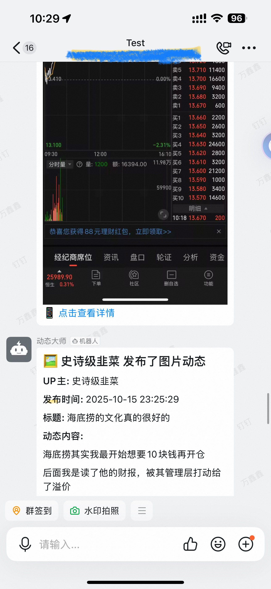

# B站动态监控机器人 V2

## 🚀 项目简介

B站动态监控机器人V2是一个高效的B站UP主动态监控工具，支持自动推送新动态到钉钉群。

### ✨ 核心特性
- **🎯 超高效监控** - API请求减少66%+，响应速度提升30倍
- **⚡ 智能检测** - 全局动态检测 + 批量推送机制
- **🔄 多类型监控** - 支持动态和视频双重监控
- **💬 钉钉推送** - 自动格式化消息推送到钉钉群
- **🗃️ 去重机制** - 自动过滤重复和置顶动态
- **📊 统计功能** - 实时监控统计和日志记录

---

## 📱 效果展示

推送到钉钉群的消息效果示例：



消息包含以下信息：
- 📝 动态类型（图片动态/视频/转发等）
- 👤 UP主昵称
- ⏰ 发布时间
- 📌 动态标题
- 📄 动态内容

---

## 📂 项目文件结构

```
bili/
├── 核心程序文件 (5个)
│   ├── main_v2.py          # 主程序入口
│   ├── bili_api_v2.py      # B站API核心模块
│   ├── dingtalk_sender.py  # 钉钉消息推送模块
│   ├── database.py         # 数据库管理模块
│   └── config.py           # 配置管理模块
│
├── 配置和依赖 (2个)
│   ├── config_v2.json      # 主配置文件
│   └── requirements_v2.txt # Python依赖清单
│
├── 启动脚本 (1个)
│   └── 启动监控.bat        # 一键启动脚本（含配置向导）
│
└── 运行时文件 (自动生成)
    ├── sent_dynamics.db    # SQLite数据库
    └── bili_monitor.log    # 运行日志
```

**总计：8个核心文件**

---

## 🔧 安装指南

### 1. 安装Python

**环境要求：** Python 3.7+ (推荐 Python 3.8 或更高版本)

**安装教程请参考：**
- [廖雪峰Python教程 - 安装Python](https://liaoxuefeng.com/books/python/install/index.html)
- [Python官方下载](https://www.python.org/downloads/)

**验证安装：**
```bash
# Windows
python --version

# macOS/Linux
python3 --version
```

### 2. 安装项目依赖

```bash
# Windows（使用清华源，速度更快）
pip install -r requirements_v2.txt -i https://pypi.tuna.tsinghua.edu.cn/simple

# macOS/Linux（使用清华源，速度更快）
pip3 install -r requirements_v2.txt -i https://pypi.tuna.tsinghua.edu.cn/simple
```

---

## ⚙️ 配置说明

### 配置文件：config_v2.json

```json
{
  "dingtalk": {
    "webhook_url": "钉钉机器人Webhook地址",
    "secret": "加签密钥（可选）"
  },
  "bilibili": {
    "cookie_string": "完整的B站Cookie字符串",
    "up_list": [
      {
        "uid": "UP主UID",
        "name": "UP主昵称", 
        "enabled": true,
        "monitor_types": ["dynamic", "video"]
      }
    ],
    "global_update_check_interval_minutes": 1,
    "check_interval_minutes": 5,
    "api_settings": {
      "min_interval": 3.0,
      "request_timeout": 15,
      "retry_count": 3
    }
  },
  "database": {
    "file": "sent_dynamics.db",
    "cleanup_days": 30
  },
  "logging": {
    "level": "INFO",
    "file": "bili_monitor.log",
    "max_size_mb": 10,
    "backup_count": 5
  }
}
```

---

### 1. 钉钉机器人配置

#### 如何创建钉钉机器人

**详细教程请参考钉钉官方文档：**
- [自定义机器人创建和安装](https://open.dingtalk.com/document/orgapp/custom-bot-creation-and-installation)
- [获取自定义机器人Webhook地址](https://open.dingtalk.com/document/orgapp/obtain-the-webhook-address-of-a-custom-robot)

#### 配置步骤（简要）

1. **进入群设置** → 智能群助手 → 添加机器人 → 自定义机器人
2. **配置安全设置**（必选其一）：
   - ⭐ 加签（推荐）：复制生成的Secret密钥
   - 自定义关键词：设置关键词如"动态"、"视频"
   - IP地址白名单：填写服务器IP
3. **获取Webhook地址**：复制生成的Webhook URL
4. **填入配置文件**：
   ```json
   {
     "dingtalk": {
       "webhook_url": "https://oapi.dingtalk.com/robot/send?access_token=你的token",
       "secret": "SEC你的加签密钥（如果使用加签）"
     }
   }
   ```

#### 测试连接

```bash
# Windows
python main_v2.py test

# macOS/Linux
python3 main_v2.py test
```

---

### 2. B站Cookie配置

#### 获取Cookie

1. 浏览器登录B站 (https://www.bilibili.com)
2. 按 `F12` 打开开发者工具
3. 切换到 `Network` 标签页，刷新页面
4. 点击任意请求，找到 `Request Headers` 中的 `Cookie`
5. 复制完整Cookie字符串到配置文件

**配置示例：**
```json
{
  "bilibili": {
    "cookie_string": "SESSDATA=xxx; bili_jct=xxx; DedeUserID=xxx; ..."
  }
}
```

**注意：** Cookie有效期通常为2-6个月，过期后需重新获取

---

### 3. UP主监控配置

#### 添加要监控的UP主

```json
{
  "up_list": [
    {
      "uid": "322005137",           // UP主UID（从主页URL获取）
      "name": "影视飓风",            // UP主昵称
      "enabled": true,               // 是否启用
      "monitor_types": ["dynamic", "video"]  // 监控类型
    }
  ]
}
```

**配置说明：**
- `uid`：UP主UID，访问主页URL查看，如 `https://space.bilibili.com/322005137`
- `monitor_types`：
  - `["dynamic"]` - 仅监控动态
  - `["video"]` - 仅监控视频
  - `["dynamic", "video"]` - 同时监控（推荐）

---

### 4. 监控频率配置

#### 推荐配置（根据监控UP主数量）

| UP主数量 | global_check (分钟) | check_interval (分钟) | min_interval (秒) |
|---------|--------------------|--------------------|------------------|
| 1-3个   | 1                  | 5                  | 3.0              |
| 4-10个  | 2                  | 10                 | 4.0              |
| 10+个   | 3                  | 15                 | 5.0              |

**配置参数说明：**
- `global_update_check_interval_minutes`：全局检测间隔（推荐1-3分钟）
- `check_interval_minutes`：完整检查间隔（推荐5-15分钟）
- `api_settings.min_interval`：API请求最小间隔（推荐3-5秒，防止限流）

**示例配置（4-10个UP主）：**
```json
{
  "global_update_check_interval_minutes": 2,
  "check_interval_minutes": 10,
  "api_settings": {
    "min_interval": 4.0,
    "request_timeout": 15,
    "retry_count": 3
  }
}
```

---

## 🚀 使用方法

### 启动监控

```bash
# Windows - 双击运行
启动监控.bat

# 或命令行启动
python main_v2.py start

# macOS/Linux
python3 main_v2.py start
```

### 测试配置

```bash
# Windows
python main_v2.py test

# macOS/Linux
python3 main_v2.py test
```

### 查看日志

运行日志保存在 `bili_monitor.log` 文件中。

---

## 📚 参考文档

- [廖雪峰Python教程 - 安装Python](https://liaoxuefeng.com/books/python/install/index.html)
- [Python官方网站](https://www.python.org/downloads/)
- [钉钉自定义机器人创建和安装](https://open.dingtalk.com/document/orgapp/custom-bot-creation-and-installation)
- [获取钉钉机器人Webhook地址](https://open.dingtalk.com/document/orgapp/obtain-the-webhook-address-of-a-custom-robot)

---

**🎉 享受高效的B站动态监控体验！**
